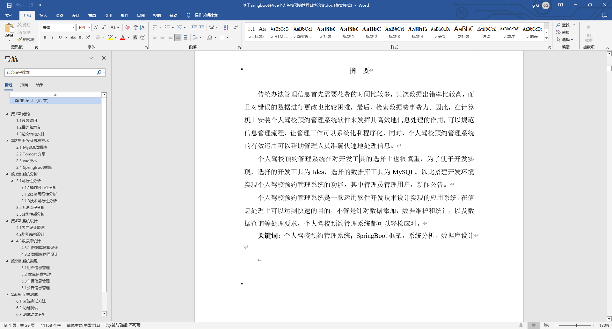
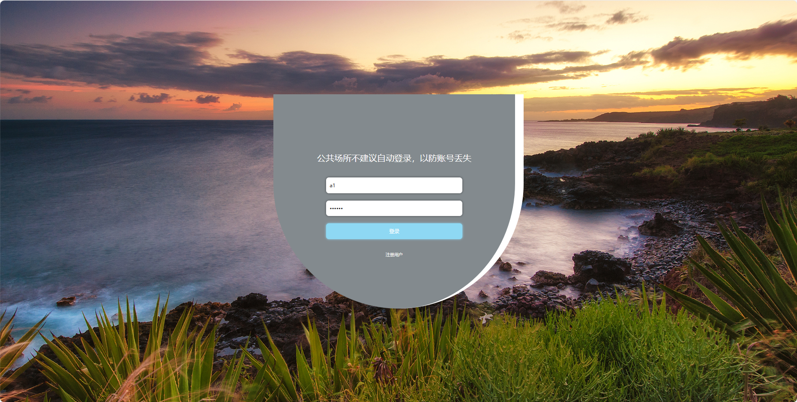
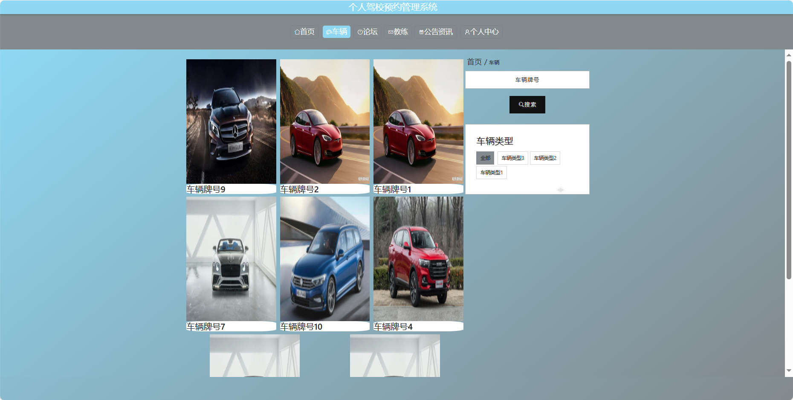
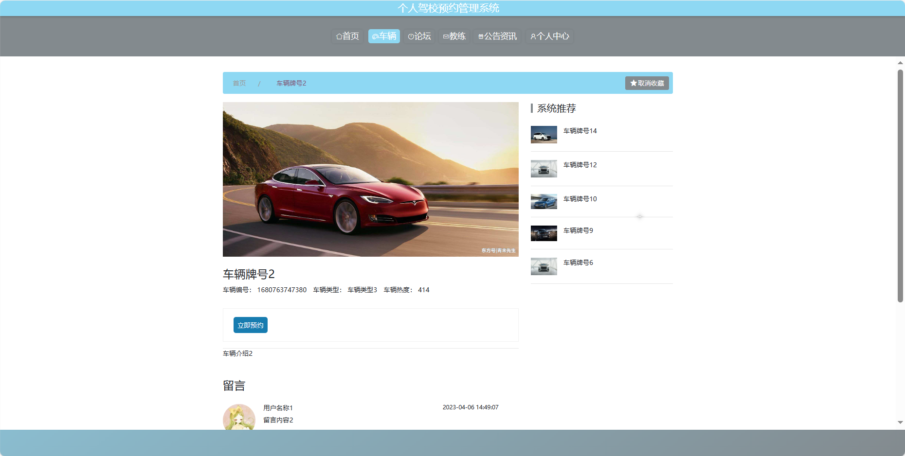
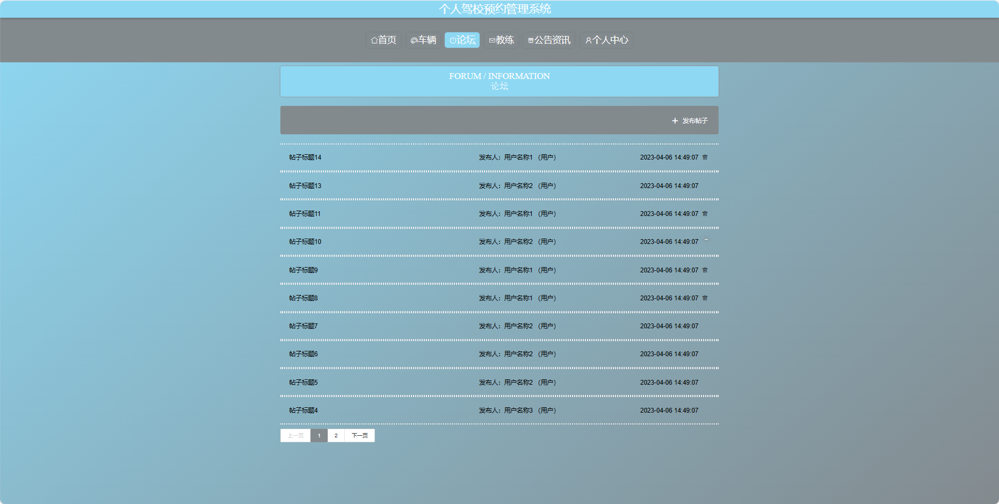
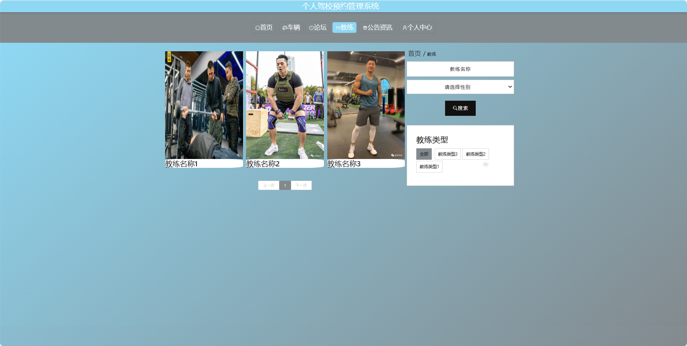
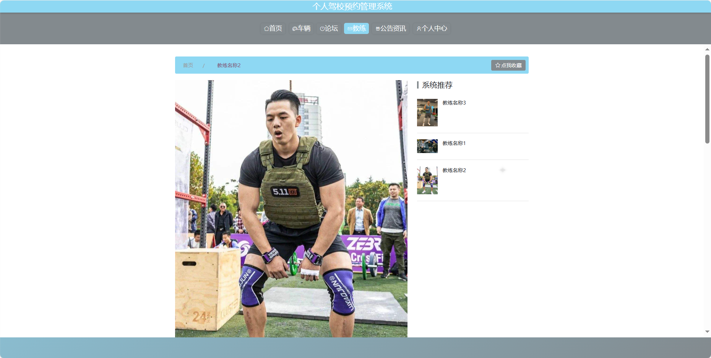

基于Springboot的个人驾校预约管理系统（程序+论文）
=
### 完整代码获取地址：从戎源码网 ([https://armycodes.com/](https://armycodes.com/))
### 作者微信：19941326836  QQ：952045282 
### 承接计算机毕业设计、Java毕业设计、Python毕业设计、深度学习、机器学习
### 选题+开题报告+任务书+程序定制+安装调试+论文+答辩ppt 一条龙服务
### 所有选题地址https://github.com/nature924/allProject

一、项目介绍
---
基于Spring Boot框架实现的个人驾校预约管理系统，系统包含三种角色：管理员、用户、教练，主要功能如下。

### 【用户功能】
1. 首页：获取系统信息。
2. 车辆：查看可预约的车辆信息。
3. 论坛：与其他用户分享驾驶心得和交流。
4. 教练：浏览教练的个人信息和可预约时间。
5. 公告资讯：了解最新的驾校资讯。
6. 个人中心：管理个人信息和查看预约记录。

### 【管理员功能】
1. 首页：查看系统整体。
2. 个人中心：管理管理员的个人信息。
3. 管理员管理：维护系统管理员的账户信息。
4. 用户管理：查看和管理系统用户的信息。
5. 教练管理：添加、编辑和删除教练信息。
6. 教练预约管理：审核和管理用户对教练的预约服务。
7. 车辆管理：管理驾校的车辆信息。
8. 车辆预约管理：审核和管理用户对车辆的预约服务。
9. 基础数据管理：管理系统的基础数据，如车辆类型等。
10. 论坛管理：审核和回复用户在论坛上的帖子。
11. 公告资讯管理：发布、编辑和管理驾校的公告资讯。
12. 轮播图信息：管理系统首页的轮播图展示。

### 【教练功能】
1. 首页：查看教练个人信息
2. 个人中心：管理教练的个人信息。
3. 教练管理：编辑可预约时间和车型信息。
4. 教练预约管理：查看和管理用户对教练的预约服务。
5. 车辆管理：查看可使用的车辆信息。
6. 车辆预约管理：查看和管理用户对车辆的预约服务。
7. 论坛管理：回复用户在论坛上的帖子。
8. 公告资讯管理：发布、编辑和管理驾校的公告资讯。

二、项目技术
---
- 编程语言：Java
- 数据库：MySQL
- 项目管理工具：Maven
- 前端技术：VUE、HTML、Jquery、Bootstrap
- 后端技术：Spring、SpringMVC、MyBatis

三、运行环境
---
- 操作系统：Windows、macOS都可以
- JDK版本：JDK1.8以上都可以
- 开发工具：IDEA、Ecplise、Myecplise都可以
- 数据库: MySQL5.7以上都可以
- Tomcat：任意版本都可以
- Maven：任意版本都可以

四、运行截图
---
### 论文截图：

### 程序截图：

